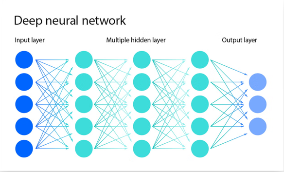
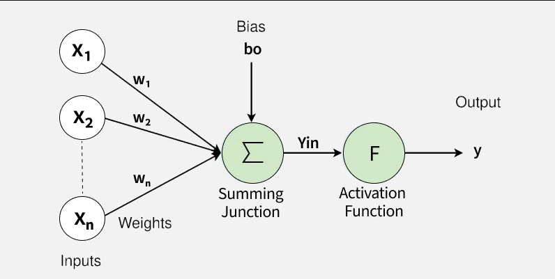
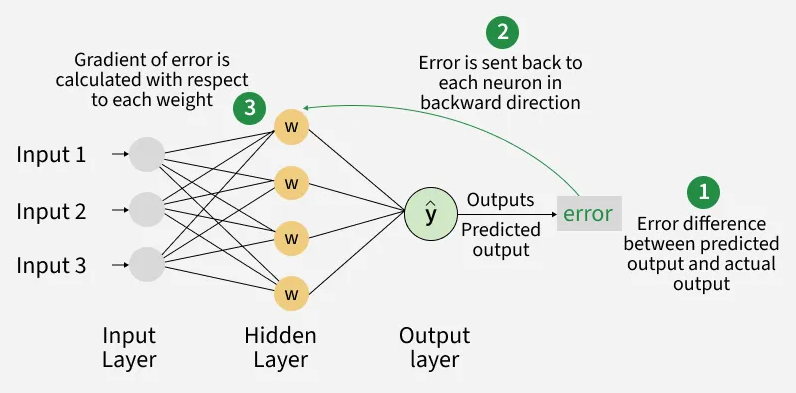
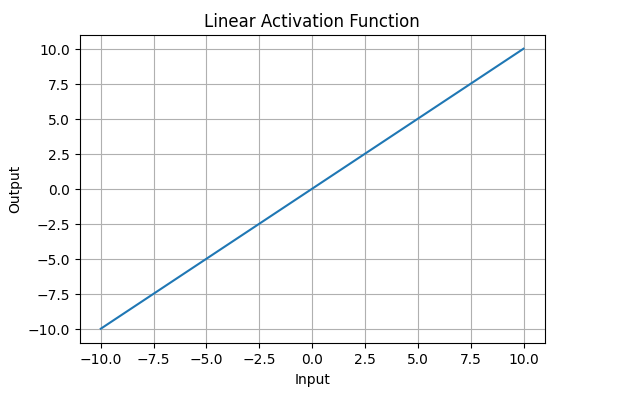
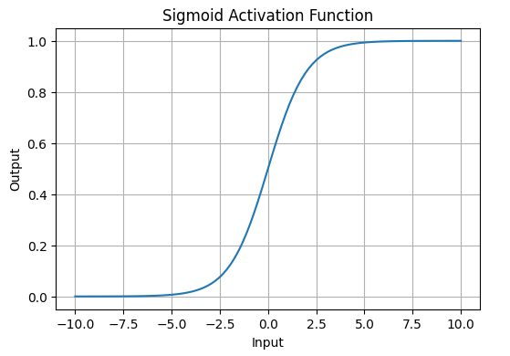
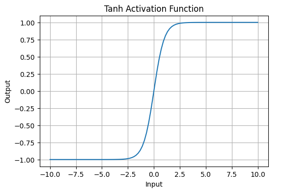
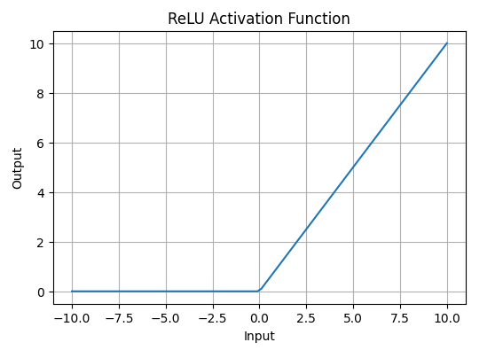
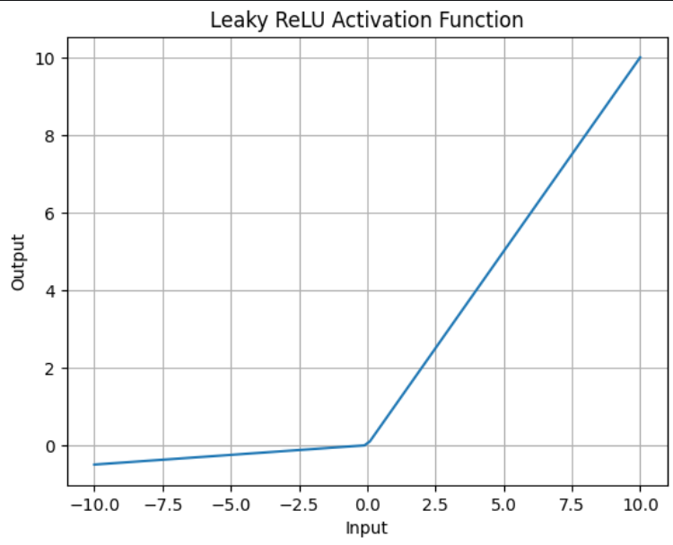
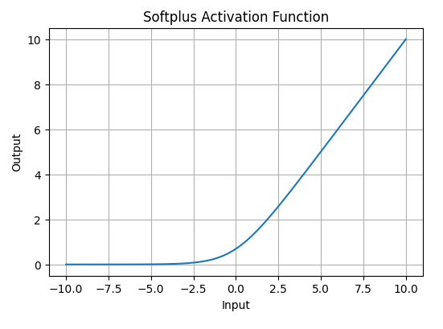
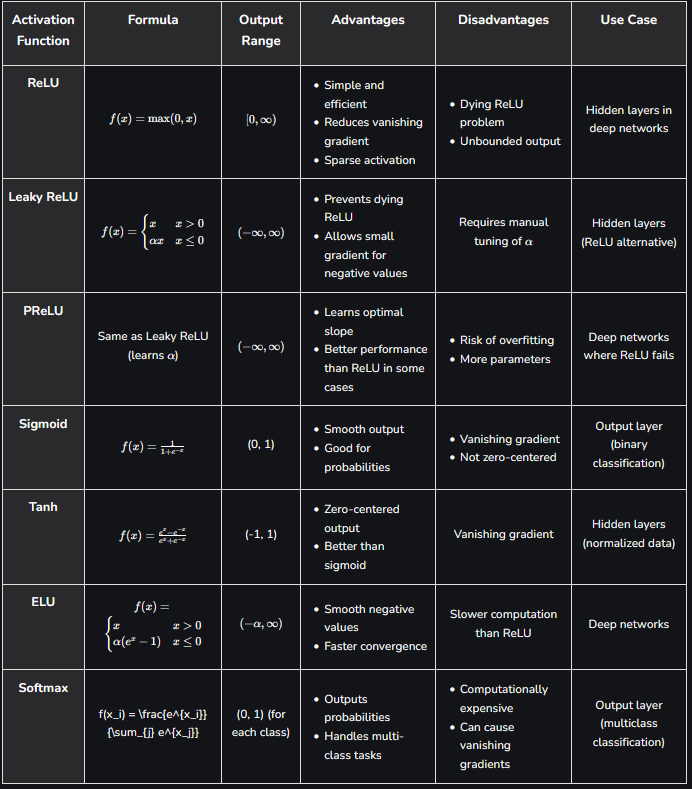

# What is a Neural Network?

> "A neural network (NN) is a machine learning model that stacks simple "neurons" in layers and learns pattern-recognizing weights and biases from data to map inputs to outputs."
> https://www.ibm.com/think/topics/neural-networks

## Neural networks in general

- are **machine learning** algorithms.
- are inspired by the human brain.
- are the foundation of most known public AI models.
- learn from data by identifying patterns.
- consist of connected units or nodes, that are called artificial neurons.
  - each node connects to other node along edges, that represent the synapses of the human brain.
  - when a node receives a signal, it processes it and sends the signal along its edges to the next nodes.
  - when a node processes a signal it
- use two fundamental concepts for their neurons: Weights and Biases
  - both parameters are adjusted in the learning process and are used in the processing of the neurons.
- use an activation function $a$ to determine when a neuron fires and when not.
- can be described mathematically as: $f(X) \longrightarrow Y$ with $X = (x_1, x_2, x_3, ..., x_n)$

## Components of a neural network

A neural network generally consists of multiple layers:

1. The **input layer** holds the raw features (e.g. Image pixels, audio samples, letters, words...)
2. The **hidden layers** consist of artificial neurons that process the inputs according to their weights, biases and activation function. This is where the transformation between input and output happens.
3. The **output layer** contains the final prediction (e.g. a probability or a classification).

> Image sourced from: https://www.ibm.com/think/topics/neural-networks

As mentioned earlier, each node also has multiple components:

1. The **inputs** that are received from the input layer as raw features or from the previous hidden layers as processed data.
2. The **weights** that are adjusted during training process and determine how strongly the different inputs are accounted for.
3. The **summing function** that takes all inputs and sums them up according to their weight.
4. The **bias** that is added to the summing function after the inputs are summed up and also adjusted during learning.
5. The **activation function**: A mathematical formula applied to the weighted sum of inputs inside a neuron. It decides if the neuron should fire or pass information. It brings non-linearity into the network.

> Image source from: https://www.geeksforgeeks.org/deep-learning/the-role-of-weights-and-bias-in-neural-networks/

# Training process of a neural network

> Text source from: https://www.geeksforgeeks.org/deep-learning/the-role-of-weights-and-bias-in-neural-networks/

The trainign process usually consists of multiple stages:

## 1. Forward propagation

The data is processed through the neural network and produces an output or prediction.

1. **Input Layer**: The process starts with data entering the input layer, such as image pixels or feature values from a dataset.
2. **Weighted Sum**: Each neuron multiplies inputs with their weights and adds them to calculate a total value, showing the importance of each input.

   $$s = \sum^n_{i=1} w_i\cdot x_i $$

3. **Adding Biases**: A bias is added to this value to shift the output and help the model learn better patterns.

   $$ z = s + b $$

4. **Activation Function**: The result is passed through an activation function (like ReLU or sigmoid) to decide whether the neuron should activate or not.

   $$ a = \sigma(z) $$

5. **Propagation**: The output is passed to the next layer, and this process continues until the final prediction is generated.

## 2. Backpropagation

The produced output is evaluated and the output error is used to adjust the parameters of each neuron.

1. **Error Calculation**: The predicted output is compared with the actual value, and the difference is calculated as error or loss.
2. **Gradient Calculation**: The error is sent backward through the network to calculate how each weight and bias contributed to it.
3. **Updating Weights and Biases**: The network adjusts weights and biases using optimization methods like gradient descent to reduce the error.

# Different activation function in neural networks

> Text sourced from: https://www.geeksforgeeks.org/machine-learning/activation-functions-neural-networks/

## 1. Linear Activation Function

Linear Activation Function resembles a straight line define by y=x. No matter how many layers the neural network contains if they all use linear activation functions the output is a linear combination of the input.

- The range of the output spans from (−∞ to +∞)(−∞ to +∞).
- Output is a linear combination of inputs
- Using it in all layers makes the network behave like a linear model
- Limits the ability to learn complex patterns
- Commonly used in the output layer for regression tasks
- Often combined with non-linear functions in hidden layers for better learning

## 2. Sigmoid Function

Sigmoid Activation Function is characterized by 'S' shape. It is mathematically defined as $A = \frac{1}{1+e^{-x}}$​​. This formula ensures a smooth and continuous output that is essential for gradient-based optimization methods.

- It allows neural networks to handle and model complex patterns that linear equations cannot.
- The output ranges between 0 and 1, hence useful for binary classification.
- The function exhibits a steep gradient when x values are between -2 and 2. This sensitivity means that small changes in input x can cause significant changes in output y which is critical during the training process.
- Rarely used these days > vanishing gradient problem.

## 3. Tanh Activation Function

Tanh function (hyperbolic tangent function) is a shifted version of the sigmoid, allowing it to stretch across the y-axis. It is defined as:

$$
    f(x) = tanh(x) = \frac{2}{1+e^{-2x}}-1
$$

- Outputs values from -1 to +1.
- Enables modeling of complex data patterns.
- Commonly used in hidden layers due to its zero-centered output, facilitating easier learning for subsequent layers.
- Rarely used these days > vanishing gradient problem.

## 4. ReLU(Rectified Linear Unit)Function

ReLU activation is defined by A(x)=max⁡(0,x)A(x)=max(0,x), this means that if the input x is positive, ReLU returns x, if the input is negative, it returns 0.

- Value Range is[0,∞)[0,∞), meaning the function only outputs non-negative values.
- Introduces non-linearity, enabling learning of complex patterns
- Computationally efficient due to simple operations
- Activates only positive neurons, making the network sparse and efficient
- Commonly used in hidden layers for faster training and better performance

## 5. Leaky ReLU

$$
    f(x) = \begin{cases} x, & x > 0 \\ \alpha x, & x \leq 0 \end{cases}
$$

- Leaky ReLU is similar to ReLU but allows a small negative slope (αα, e.g., 0.01) instead of zero.
- Solves the “dying ReLU” problem, where neurons get stuck with zero outputs.
- Range: (−∞,∞)(−∞,∞).
- Preferred in some cases for better gradient flow.

## 6. SoftPlus Function

Softplus function is defined mathematically as: $A(x) = log(1 + e^x)$. It is similar to ReLU but avoids sharp transitions by being fully differentiable.

- The Softplus function is non-linear.
- The function outputs values in the range (0,∞)(0,∞), similar to ReLU, but without the hard zero threshold that ReLU has.
- Softplus is a smooth, continuous function, meaning it avoids the sharp discontinuities of ReLU which can sometimes lead to problems during optimization.

## Overview

